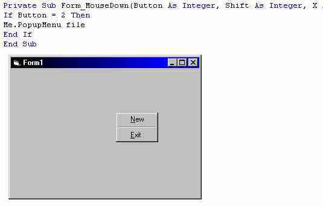



## PopUp Menu Tutorial

### Description

Ever wonder how to make those cool popup menu's? Well This tutorial will tell you how to make them, how to detect which mouse button has been pressed, and how to make them popup on different mouse button clicks.
 
### More Info
 

             |
---                |---
**Submitted On**   |
**By**             |[Sean  Gallardy](https://github.com/Planet-Source-Code/PSCIndex/blob/master/ByAuthor/sean-gallardy.md)
**Level**          |Beginner
**User Rating**    |4.0 (32 globes from 8 users)
**Compatibility**  |VB 3\.0, VB 4\.0 \(16\-bit\), VB 4\.0 \(32\-bit\), VB 5\.0, VB 6\.0, VB Script, ASP \(Active Server Pages\) 
**Category**       |[Custom Controls/ Forms/  Menus](https://github.com/Planet-Source-Code/PSCIndex/blob/master/ByCategory/custom-controls-forms-menus__1-4.md)
**World**          |[Visual Basic](https://github.com/Planet-Source-Code/PSCIndex/blob/master/ByWorld/visual-basic.md)
**Archive File**   |

### Source Code

First, create a new project. now, click on the menu editor. tpye in a name for the menu(i.e. file), and set it's properties to not visible. now create some sub menu's by clicking on the line directly below where your first menu is. then click on the arrow that is pointing to the right. four little dots should appear before the menu name( i.e. ....&New). keep on creating sub menu's until your heart's content[note, you can have sub menu's of the sub menu's. just click the right arrow again]. keep all of the sub menu's visible but only set the original file(or whatever you names it) not visible. now exit the menu editor. click on view code(or double click on the form). from the left hand side combo box(which is located directly above the code input area), make sure that form1(or whatever the name of the form is) is selected. then look at the right hand combo box, select the mousedown event. the event has 4 variables, each mean somehtign different.
<b>Button =</b><u> which mouse button was clicked. if button = 1 then the first mouse button was clicked(which is the mouse button that you use to select items and navigate). if button = 2 then that is the mouse button that you use to bring up popup menu's in windows(i.e. when you click that mouse button on your desktop and are able to select menu;s like new or properties). and button = 3 (which is for the 3 buttoned mice out there.).</u>
<b>Shift =</b><u> tell whether the shift button is being held. shift = 1 then button is being held, shift = 0 the shift button isnt being held.</u>
<b>x =</b><u>this is the location where the popup menu will be on the left side of the screen. the bigger the number the farther from the left side of the screen it goes, the smaller number the closer to the left side of the screen it goes.</u>
<b>y =</b><u>this is the same thign as x except that y control the top of the screen, the smaller the number the closer to the top, the larger the number the closer to the bottom.</u>
Now that you know what all the variables mean, it's time to add the code.
you can use 2 different statements (that i know of[i keep learning new thigns, don't we all]) that you can use to choose whether the menu will opup or not.
first is the if statement(which i use because it is easier for this purpose and doesnt need ot be complex).
let's say you wanted your popupmenu to come up at the x location of 300 and the y location of 300 when the user clicks the number 2 mouse button. you'd put in this.
if button = 2 then
me.popupmenu file,,300,300
'in the place of file that i have here use whatever you named the very first menu(not the submenu's)
end if
REMEMBER YOU MUST HAVE SUBMENU'S TO MAKE A POPUP MENU.
you can play with that so that the menu will popup when the first mouse button is clicked or the 3rd. you can make it come up at x300 and y300 or if you want it to come up where ever the user clicked just put
me.popupmenu file
the other is the select case. say you wanted only certain menu's to come up with certain mouse lcis, the if statement for this type is too slow and is messy. you would still use the same code as above for the popup menu, but in a select case format.
you can make popup menu's only come up on certain object by going to view>code and then choosing say a text box. then choose the mousedown event for the text box control.
I hope that this helps some people. If you need any help, i will be happy to send you the source code or give you any help you need.
-Sean

